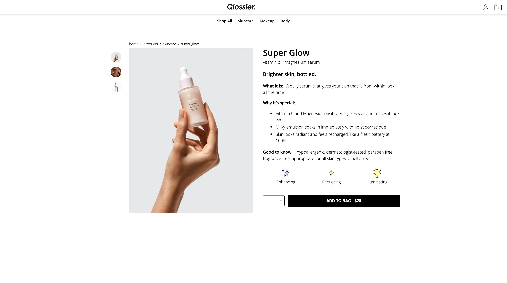

## Summary:

This is a high-quality dupe of Glossier.com: a modern, and sleek e-commerce site. It currently has user auth, products, cart and checkout functionality. The app is written with a React / Redux frontend, and Ruby on Rails, Postgresql backend. Check it out! 

---------------
## Key features:
	
### User Auth

Users can demo login, make accounts, sign-in, and sign-out. Sessions tokens are used to keep track of user sessions. User information is secure via strong parameters in the controller, salting and hashing user passwords, and sanitized user input. The sign-in and sign-up pages are protected via auth-routes in the frontend.

### Products

Product tables were carefully designed for easy changing, and scalability in the relational database. This means that adding/ changing/ removing features can be done without dropping the database. Efficient querying allows all the information to be fetched in one ajax call. On the frontend, the redux state shape was optimized to be flat, and reusable. Two product reducers were created for scalability, and efficiency. One type is simplified for the indexing, and the other contains all of a single product’s information. 

### Cart

Carts are available for both anonymous users, and logged-in users. Anonymous carts are created with the user id pointing to the user’s IP address, while owned carts are generated on account creation. Products are associated indirectly via “cart items”, which belong to a single cart. I chose to calculate cart numbers in the reducer. This results in 1) no repeated data being stored in the backend 2) only one centralized operation is done. 

### Checkout/Orders

Both checkout, and orders are currently in a simplified state, but additional features can easily be added in the future. The checkout page is only available to logged-in users who have at least one item in their cart. This will be changed once checkout parameters are changeable. Order numbers and tracking numbers are automatically generated on the backend when an order instance is created. 
